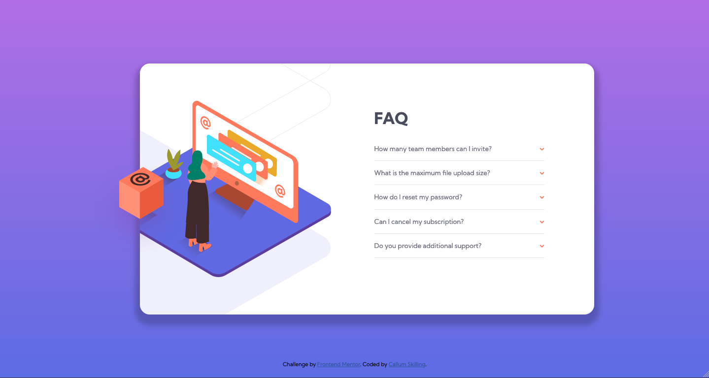

# Frontend Mentor - FAQ accordion card solution

This is a solution to the [FAQ accordion card challenge on Frontend Mentor](https://www.frontendmentor.io/challenges/faq-accordion-card-XlyjD0Oam). Frontend Mentor challenges help you improve your coding skills by building realistic projects. 

## Table of contents

- [Frontend Mentor - FAQ accordion card solution](#frontend-mentor---faq-accordion-card-solution)
  - [Table of contents](#table-of-contents)
  - [Overview](#overview)
    - [The challenge](#the-challenge)
    - [Screenshots](#screenshots)
    - [Links](#links)
  - [My process](#my-process)
    - [Built with](#built-with)
    - [What I learned](#what-i-learned)
    - [Continued development](#continued-development)
  - [Author](#author)

## Overview

### The challenge

Users should be able to:

- View the optimal layout for the component depending on their device's screen size
- See hover states for all interactive elements on the page
- Hide/Show the answer to a question when the question is clicked

### Screenshots

### Links

- Solution URL: [Add solution URL here](https://your-solution-url.com)
- Live Site URL: [https://callumskilling.github.io/frontendmentor-faq_accordion_card/](https://your-live-site-url.com)

## My process

### Built with

- Semantic HTML5 markup
- CSS custom properties
- Flexbox
- CSS Grid
- Mobile-first workflow

### What I learned

This was a strange challenge because I started it a year ago and came back to it after finishing my Front End course. I didn't want to start again so I finished what I started but I think I would've tackled the structure differently if starting from scratch.

### Continued development

While CodeCademy does provide projects, they are less 'from scratch' like Frontend Mentor is, so I really just want to get lots of practice. In particular I feel like my JavaScript could have been a lot simpler. I did just want to complete this project though and it was working.

## Author

- Website - [Callum Skilling](https://github.com/callumskilling)
- Frontend Mentor - [@callumskilling](https://www.frontendmentor.io/profile/callumskilling)
